# Pettiva 🐾

> A full-stack, two-sided marketplace mobile app built with Flutter and Firebase — connecting pet owners with professional dog walkers in real time.

Pettiva was designed and built entirely from scratch as a solo project to demonstrate end-to-end mobile development skills: product thinking, UI/UX implementation, real-time backend integration, role-based authentication, and live location features.

---

## Screenshots

### Authentication
| Login | Sign Up | Sign Up with Photo |
|---|---|---|
| 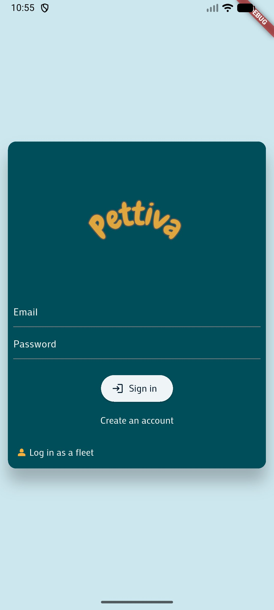 | 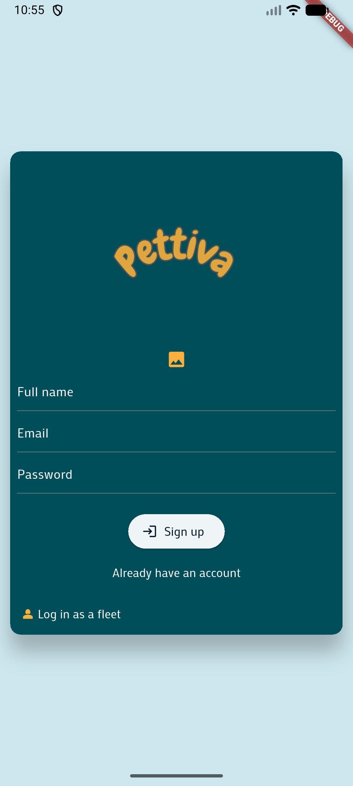 | 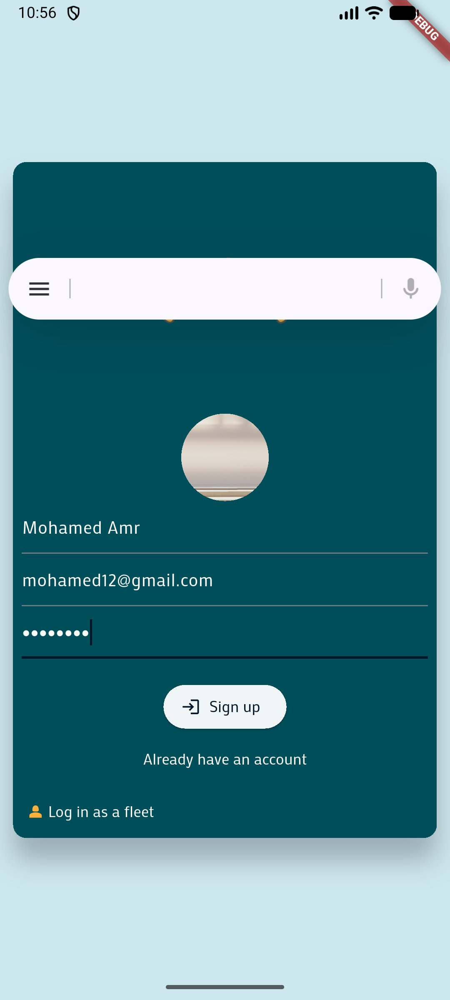 |

> Role-based auth: clients and fleet (walkers) log into entirely separate experiences from the same screen. Supports profile photo capture directly from the camera on sign-up.

---

### Home & Pet Management
| Home Screen | Add Pet | Date of Birth Picker |
|---|---|---|
| 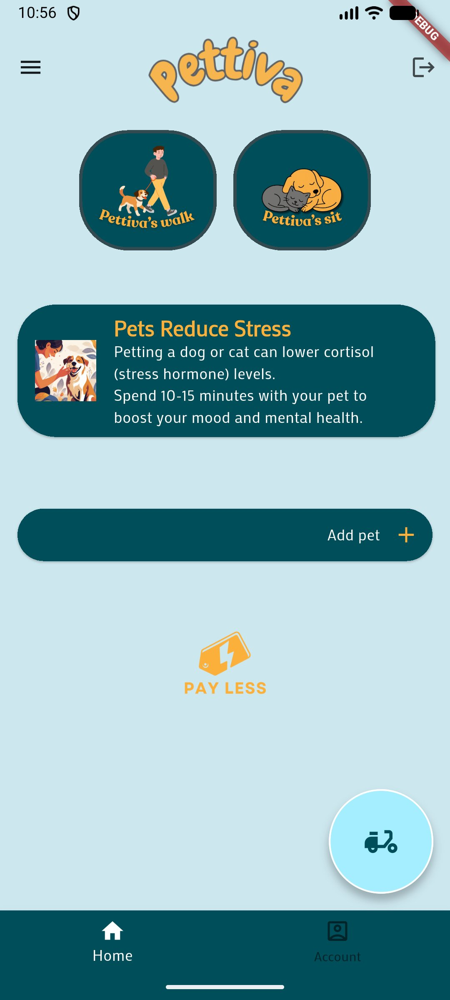 |  | 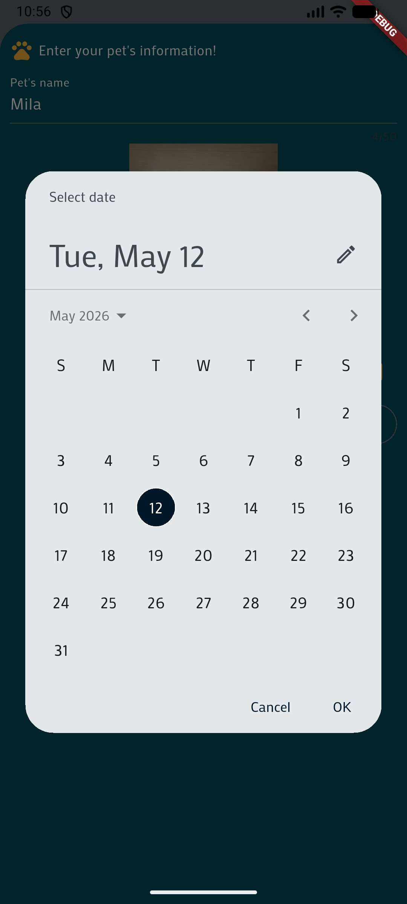 |

| Home with Pet Added |
|---|
| 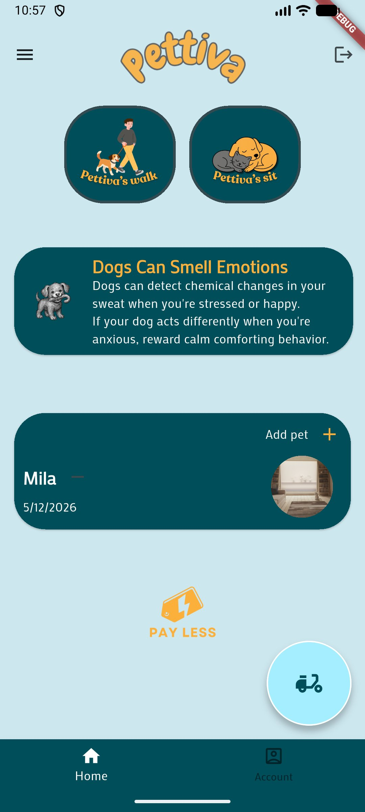 |

> The home screen features animated, auto-shuffling pet fact cards powered by a `Timer` + `AnimatedSwitcher`. Pets are stored per-user and displayed with photo and date of birth.

---

### Booking Flow
| Standard Service | Premium Service | Google Maps Picker |
|---|---|---|
| 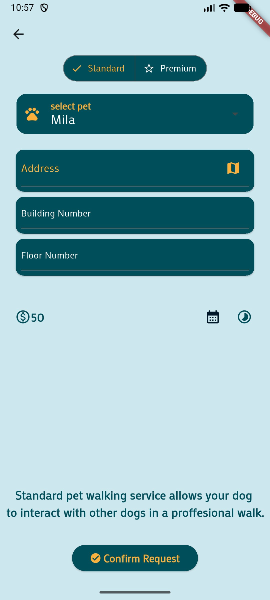 | 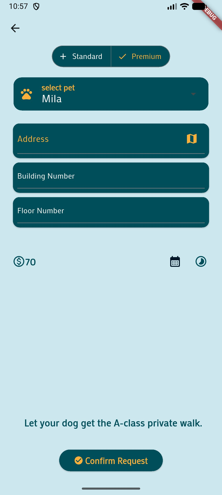 | 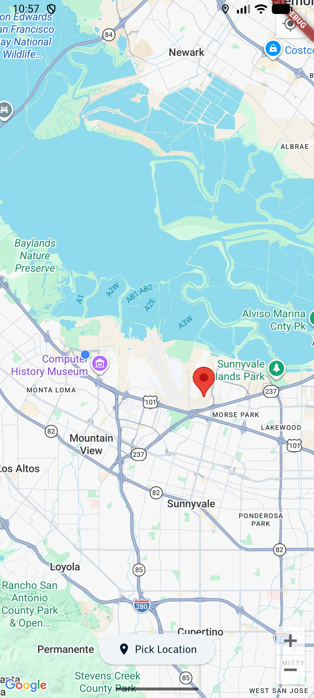 |

| Time Picker | Fully Filled Form |
|---|---|
| 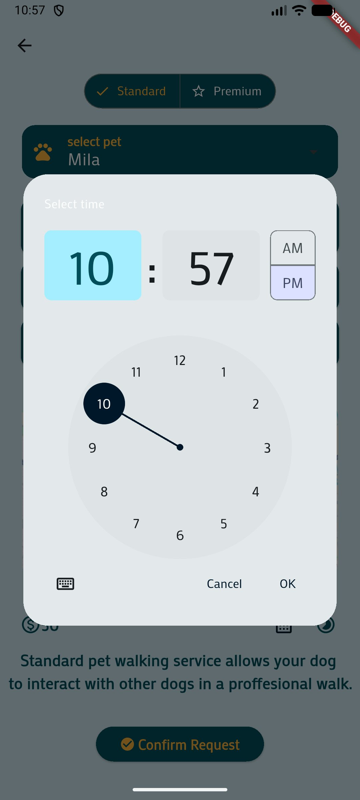 | 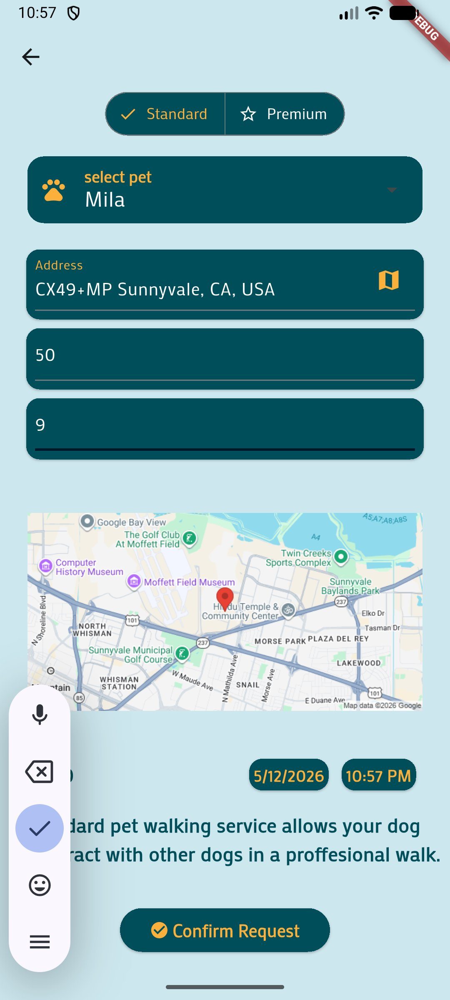 |

> The booking screen uses a `SegmentedButton` to toggle between Standard (EGP 50) and Premium (EGP 70) service tiers. Address is auto-filled via Google Geocoding API reverse lookup after the user pins their location on the full-screen map.

---

### Order Tracking
| Order Posted | Walker Accepted |
|---|---|
|  |  |

> Order status updates in real time via Firestore `StreamBuilder`. The card UI changes icon, colour, and message the moment a fleet member accepts the order — no refresh needed.

---

### Account & Settings
| Account | Settings (Locked) | Settings (Editing) |
|---|---|---|
|  |  |  |

---

### Email Verification Flow — End to End
This is one of the more technically involved features in the app. Changing your email is not just a field update — it triggers a real Firebase security flow across four steps.

| 1. Verification sent (snackbar) | 2. Email arrives in inbox | 3. Firebase confirms in browser | 4. App detects confirmation & updates |
|---|---|---|---|
| 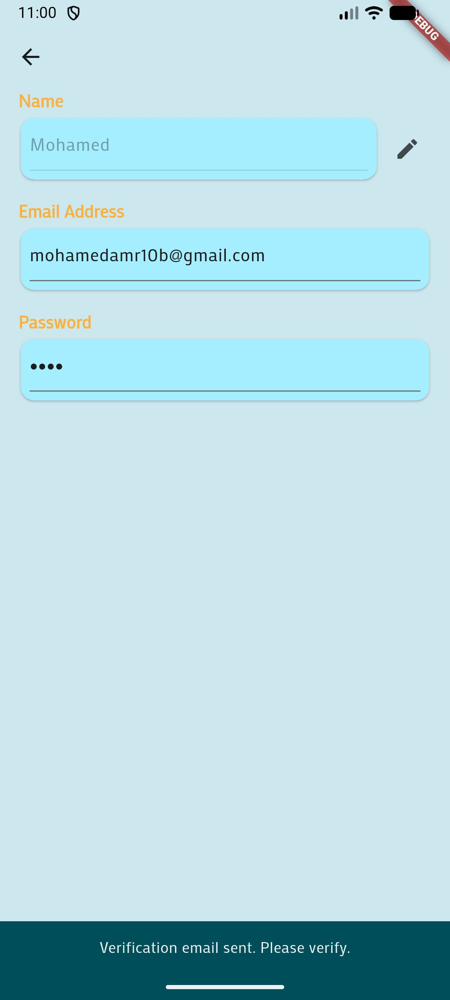 | 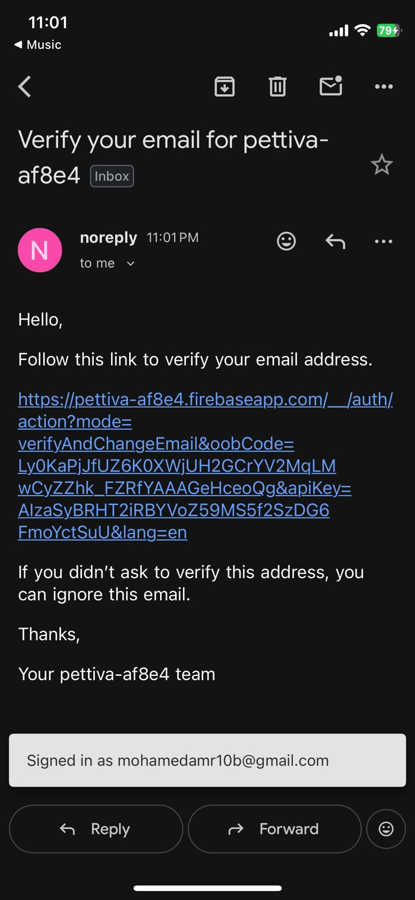 | 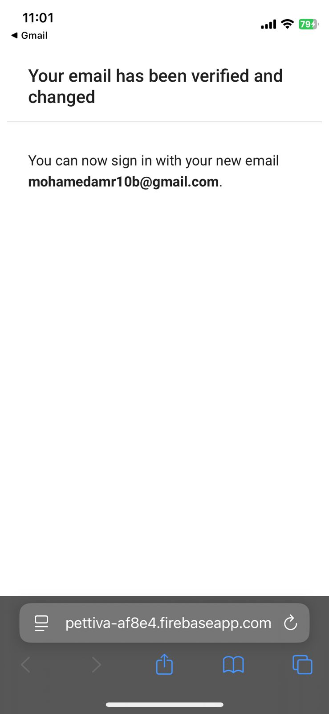 | 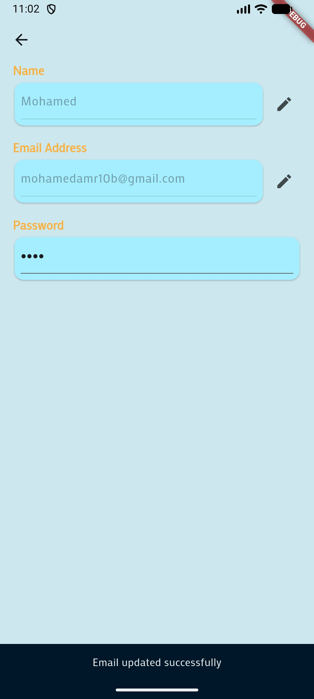 |

After confirming, the user is prompted to log in again with the new email — auth state is fully consistent.

| Re-login with new email | Completed Requests History |
|---|---|
| 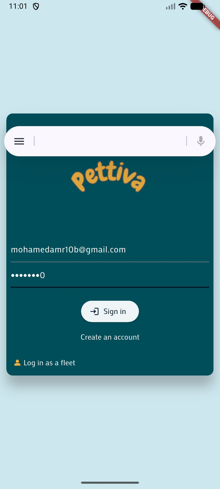 | 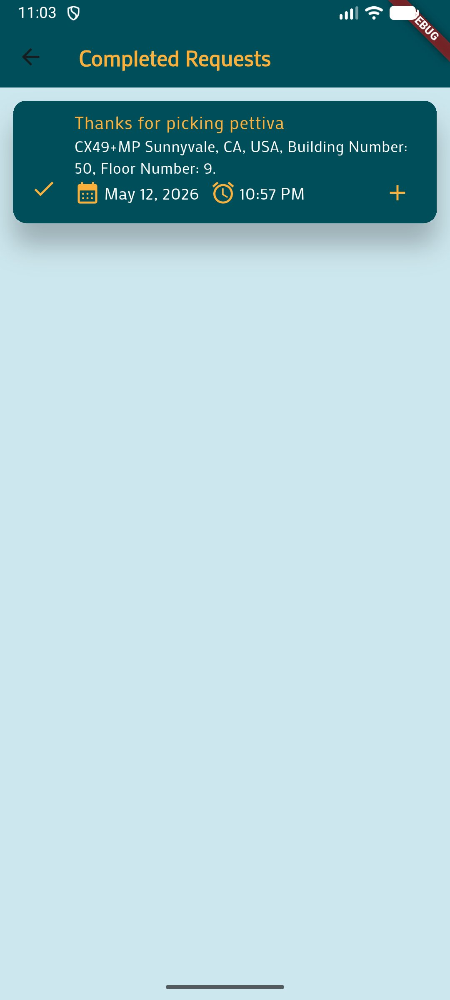 |

> The verification loop uses `verifyBeforeUpdateEmail()`, then polls `user.reload()` every 3 seconds inside a `while (!verified)` loop. Firestore is only updated after `currentUser.email` matches the new value — ensuring the database never holds an unverified email address.

---

## What This Project Demonstrates

This project was built to reflect real-world mobile development capability across the full stack.

**Flutter & Dart**
- Stateful and stateless widgets, `ConsumerStatefulWidget` with Riverpod
- `StreamBuilder` and `FutureBuilder` for reactive UI, with correct `Future` lifecycle management to prevent infinite rebuild loops
- `AnimatedSwitcher` + `SlideTransition` + `Timer` for smooth auto-cycling card animations
- `SegmentedButton`, `DropdownMenu`, `Dismissible`, `ModalBottomSheet`, native date and time pickers
- Multi-screen navigation with `Navigator.push` / `MaterialPageRoute`
- `BottomNavigationBar`, `Drawer`, `FloatingActionButton`
- Custom theming with `ColorScheme`, `GoogleFonts`, and `CardTheme`

**Firebase**
- Firebase Auth: email/password sign-up, sign-in, `verifyBeforeUpdateEmail` with async polling loop
- Cloud Firestore: real-time streams, compound queries, `FieldValue.arrayUnion`, order status state machine (`posted` → `accepted` → `done`)
- Firebase Realtime Database: per-user pet list with full CRUD via REST
- Role-based routing: `userType` field in Firestore determines whether a logged-in user reaches the client home or the fleet order feed

**Maps & Location**
- `google_maps_flutter`: interactive full-screen map with tap-to-place marker and current-location button
- `location` package: runtime GPS permission handling for both Android and iOS
- Google Geocoding API: reverse geocoding coordinates to a human-readable address
- Google Static Maps API: inline map thumbnail rendered live from stored coordinates

**Architecture & Patterns**
- Riverpod for shared pets state across screens
- Clean separation of screens, components, models, and providers
- Two-role app (client + fleet) served from a single codebase with conditional routing at the root

---

## How It Works

A **client** signs up, adds their pet, and books a walk by selecting a service tier, pinning their location on the map, and choosing a date and time. The order is written to Firestore with status `"posted"`.

A **fleet member** logs in to a separate live feed of available orders. They can swipe to dismiss or tap accept. The moment they accept, the order status flips to `"accepted"` and the client's tracking screen updates in real time — no refresh needed. The walker marks it done to complete the order.

---

## Tech Stack

| | |
|---|---|
| Framework | Flutter (Dart) |
| State Management | Riverpod |
| Auth | Firebase Authentication |
| Primary Database | Cloud Firestore |
| Secondary Database | Firebase Realtime Database |
| Maps | Google Maps Flutter SDK |
| Geocoding | Google Geocoding API |
| Static Maps | Google Maps Static API |
| Fonts | Google Fonts — Mako |
| Image Picking | image_picker |
| HTTP | http package |
| Date Formatting | intl |

---

## Project Structure

```
lib/
├── main.dart                   # App entry, theme, auth + role routing
├── home.dart                   # Bottom nav shell
├── screens/
│   ├── auth.dart               # Login / Sign-up (client & fleet)
│   ├── start_screen.dart       # Home — service buttons, facts, pets
│   ├── pet_walking_screen.dart # Full booking form (Standard & Premium)
│   ├── pet_sitting_screen.dart # Pet sitting (in progress)
│   ├── order_summary.dart      # Ongoing orders — real-time stream
│   ├── orders_history.dart     # Completed orders history
│   ├── fleet_screen.dart       # Walker's live order feed
│   ├── accepted_order.dart     # Active order view for walker
│   ├── account_screen.dart     # User profile
│   ├── account_settings.dart   # Edit name / email with verification
│   ├── discount_screen.dart    # Discounts (in progress)
│   └── maps.dart               # Full-screen Google Maps location picker
├── components/
│   ├── fun_facts_cards.dart    # Animated auto-shuffling fact cards
│   ├── pets_card.dart          # Pet list with add / remove
│   ├── new_pet.dart            # Add pet bottom sheet
│   ├── location_input.dart     # Map thumbnail + location picker
│   ├── image_input.dart        # Camera / gallery helper
│   └── account_screen_items.dart
├── models/
│   ├── pet.dart
│   ├── user_information.dart
│   └── order_details.dart
└── providers/
    └── pets_provider.dart
```

---

## Getting Started

### Prerequisites
- Flutter SDK ≥ 3.x
- Firebase project with Auth, Firestore, and Realtime Database enabled
- Google Maps API key with Maps SDK (Android/iOS), Geocoding API, and Static Maps API enabled

### Setup

```bash
git clone https://github.com/your-username/pettiva.git
cd pettiva
flutter pub get
```

Configure Firebase by adding `google-services.json` (Android) and `GoogleService-Info.plist` (iOS), then generate `firebase_options.dart`:

```bash
flutterfire configure
```

Add your Google Maps API key to `android/app/src/main/AndroidManifest.xml` and `ios/Runner/AppDelegate.swift`.

Place app image assets under `assets/images/` and register them in `pubspec.yaml`, then run:

```bash
flutter run
```

---

## Firestore Data Model

### `users`
| Field | Type | Notes |
|---|---|---|
| userId | String | Firebase Auth UID |
| userName | String | Display name |
| emailAddress | String | |
| image | String? | Local image path |
| userType | String | `"client"` or `"fleet"` |

### `orders`
| Field | Type | Notes |
|---|---|---|
| userId | String | Client UID |
| serviceType | String | `"standard"` or `"premium"` |
| selectedPet | String | Pet name |
| address | String | Reverse-geocoded address |
| buildingNumber | String | |
| floorNumber | String | |
| date | Timestamp | |
| time | String | e.g. `"3:00 PM"` |
| status | String | `"posted"` → `"accepted"` → `"done"` |
| acceptedBy | String | Fleet UID |
| rejectedBy | Array | Fleet UIDs that dismissed the order |
| latitude | double | |
| longitude | double | |
| price | int | 50 (standard) or 70 (premium) |

---

## License

MIT